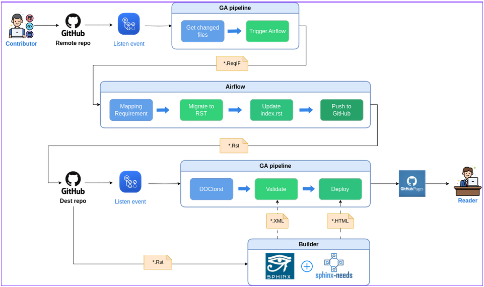

# [TheThree] Data Migration at Bosch Coderace 2023

## Introduction
- A software solution that helps migrating requirement documents from ReqIF format to RST format.
- Following the Docs-as-Code philosophy to automate documents validation and synchronization. 

## Structure

*Figure 1: The details of the structure. How does it work?*